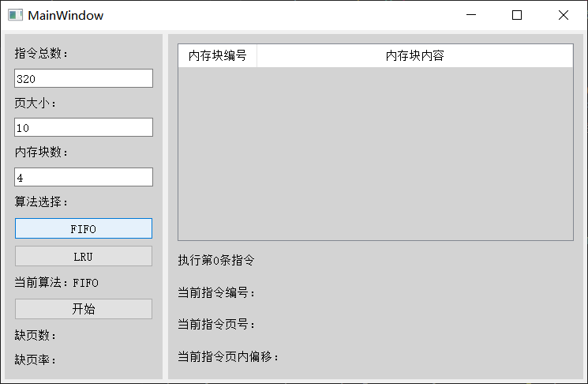
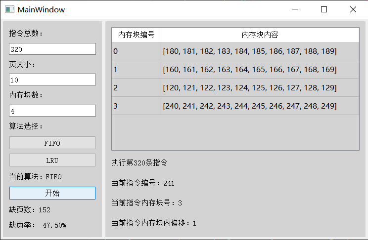
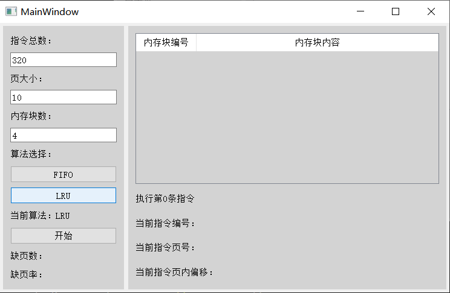
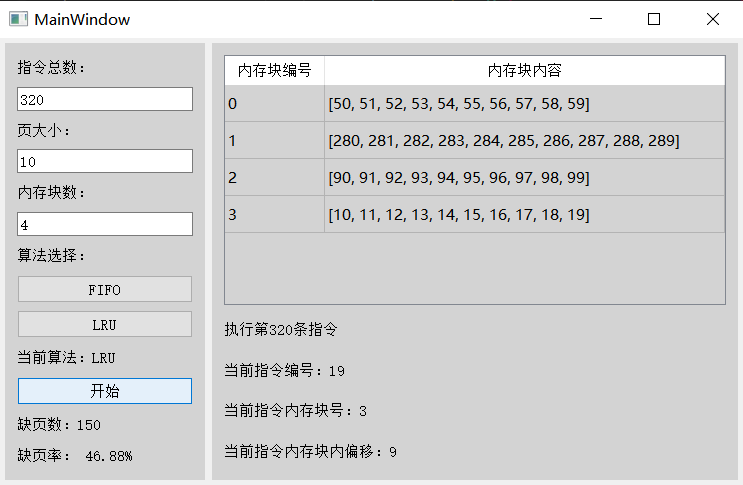

# MemoryAllocation

## 项目简介


## 项目结构

项目包含以下文件：

```
├── Task.py       # 模拟指令任务
├── Block.py      # 模拟内存块
├── Memory.py     # 模拟内存
├── Ui_Window.py  # 图形化用户界面设计
├── main.py       # 程序运行入口
├── .gitignore        # git忽略配置
├── requirements.txt  # 项目依赖项
├── README.md         # 项目说明文档
├── report.md         # 项目设计文档
└── images            # 文档需要的图片
    ├── ...
    ├── ...
    └── ...
```

## 如何运行

### 1. 安装 python

该项目使用 `python3.10.9` 请至少确保环境中安装了 `python3`

使用指令：

```shell
python --version
```

来检查环境中 `python` 的版本


### 2. 安装依赖项

使用指令：

```shell
pip install -r requirements.txt
```

来安装项目运行需要的依赖项

### 3. 运行程序

使用指令：

```shell
python .\main.py
```

来运行项目

界面整体：


选择FIFO算法：



FIFO算法结果：



选择LRU算法：



LRU算法结果：



### 4. 其他说明

默认每秒执行5条指令

可以在 `main.py` 文件的第 64 ~ 65 行自行设置

```python
QApplication.processEvents()  # 处理待处理的事件
time.sleep(0.2)               # 暂停0.2秒
```
