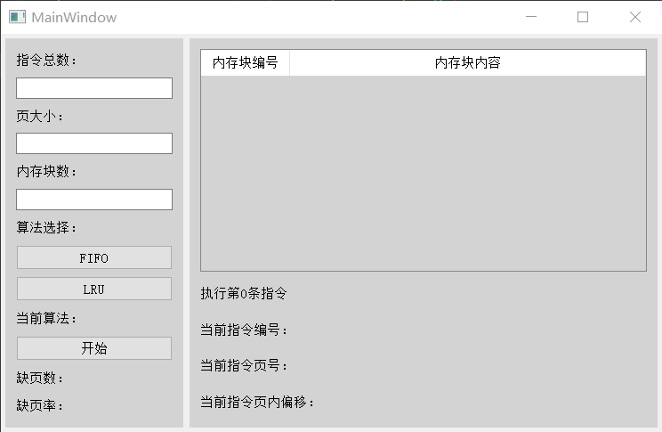
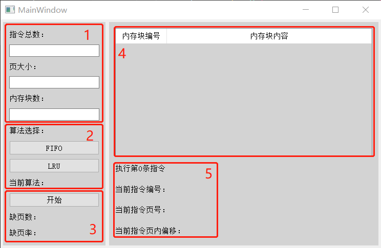
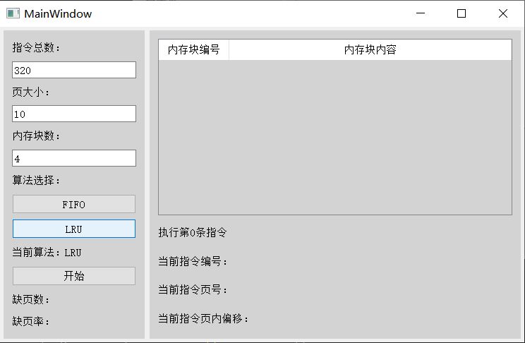
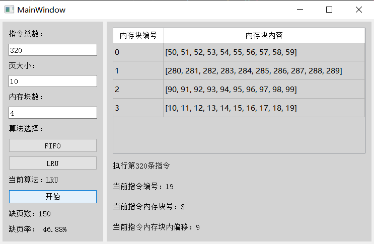

#<center> 内存管理项目设计方案

<div style="text-align:center">2051475 王浩</div>

## 项目简介

### 项目目的

模拟内存管理的请求分页分配方式，实现页面、页表、地址转换以及页面置换过程，加深对请求调页系统的原理和实现过程的理解。

### 开发环境

操作系统平台：windows10

开发框架：PyQt5

### 项目需求

模拟内存管理的请求调页存储管理方式

假设每个页面可存放10条指令，分配给一个作业的内存块为4。模拟一个作业的执行过程，该作业有320条指令，即它的地址空间为32页，目前所有页还没有调入内存。

在模拟过程中，如果所访问指令在内存中，则显示其物理地址，并转到下一条指令；如果没有在内存中，则发生缺页，此时需要记录缺页次数，并将其调入内存。如果4个内存块中已装入作业，则需进行页面置换。

所有320条指令执行完成后，计算并显示作业执行过程中发生的缺页率。

置换算法可以选用FIFO或者LRU算法

作业中指令访问次序可以按照下面原则形成：  

50%的指令是顺序执行的，25%是均匀分布在前地址部分，25％是均匀分布在后地址部分。

## 功能实现

### 模块设计

```txt
├── Task.py       # 模拟指令任务
├── Block.py      # 模拟内存块
├── Memory.py     # 模拟内存
├── Ui_Window.py  # 图形化用户界面设计
└── main.py       # 程序运行入口
```

### 生成指令

`Task` 类表示一个带有一组指令的任务

- 属性
  - `total_instructions`（整数）：指令的总数
  - `executed_instructions`（整数）：已执行的指令数，初始化为0
  - `last_instruction`（整数或None）：上一条指令的编号，初始化为None
- 方法
  - `is_task_complete()`：
    - 检查是否已执行所有指令，即已执行指令数是否等于总指令数。
    - 返回布尔值，True 表示已执行所有指令，False 表示还有指令待执行。
  - `get_instruction()`：
    - 获取下一条需要执行的指令。
    - 根据当前已执行的指令数和上一条指令的编号，确定下一条需要执行的指令。
    - 返回下一条需要执行的指令的编号。


为了实现：

- 50%的指令是顺序执行的
- 25%是均匀分布在前地址部分
- 25％是均匀分布在后地址部分

采用方法：

- 在0－319条指令之间，随机选取一个起始执行指令，如序号为m
- 顺序执行下一条指令，即序号为m+1的指令
- 通过随机数，跳转到前地址部分0－m-1中的某个指令处，其序号为m1
- 顺序执行下一条指令，即序号为m1+1的指令
- 通过随机数，跳转到后地址部分m1+2~319中的某条指令处，其序号为m2
- 顺序执行下一条指令，即m2+1处的指令。
- 重复跳转到前地址部分、顺序执行、跳转到后地址部分、顺序执行的过程，直到执行完320条指令。

在代码中：

- 已执行指令数是6的倍数
  - 指令在总地址部分均匀分布的情况下选择
  - 通过调用random.randint随机生成一个指令编号
  - 范围为0到总指令数减1。
- 已执行指令数对6取余为2
  - 指令在前地址部分均匀分布的情况下选择
  - 通过调用random.randint随机生成一个指令编号
  - 范围为0到上一条指令编号减2对总指令数取余。
- 已执行指令数对6取余为4
  - 指令在后地址部分均匀分布的情况下选择
  - 通过调用random.randint随机生成一个指令编号
  - 范围为上一条指令编号加1对总指令数取余到总指令数减1。
- 其他情况下
  - 指令按顺序执行
  - 通过计算上一条指令编号加1对总指令数取余得到下一条指令编号。

```python
def get_instruction(self):
    if self.is_task_complete() == True:  # 任务是否结束
        return None

    instruction = None  # 本次需要执行的指令编号

    # 选取一个指令执行
    if self.executed_instructions % 6 == 0:
        # 在总地址部分均匀分布的情况
        instruction = random.randint(0, self.total_instructions - 1)
    elif self.executed_instructions % 6 == 2:
        # 在前地址部分均匀分布的情况
        instruction = random.randint(0, (self.last_instruction - 2) 
        % self.total_instructions)
    elif self.executed_instructions % 6 == 4:
        # 在后地址部分均匀分布的情况
        instruction = random.randint((self.last_instruction + 1) 
        % self.total_instructions, self.total_instructions - 1)
    else:
        # 顺序执行的情况
        instruction = (self.last_instruction + 1) % self.total_instructions

    self.executed_instructions += 1      # 已执行指令个数加1
    self.last_instruction = instruction  # 更新上一条指令编号

    return instruction  # 返回本次需要执行的指令编号
```

### FIFO算法

#### `choose_accord_to_FIFO()` 方法

根据先进先出算法选择最先放入的块。

它遍历内存中的所有块，通过比较块的加载顺序（load_order）找到最先放入的块。

初始化时将第一个块（self.blocks[0]）作为最旧的块，然后遍历后续的块，比较它们的加载顺序，更新最旧的块的索引和加载顺序。

最后返回最旧的块的索引。

#### `swap_accord_to_FIFO()` 方法

根据先进先出算法选择一个块进行替换。

它首先调用 choose_accord_to_FIFO() 方法获取最旧的块的索引。

然后将选中的块中的指令与传入的页（page）进行交换，实现替换的操作。

交换后，更新选中块的加载顺序（load_order）为当前最大加载顺序加1，并更新选中块的使用顺序（usage_order）为当前最大使用顺序加1。

同时，更新最大加载顺序和最大使用顺序为当前最大值加1，以便下次使用。

```python
def choose_accord_to_FIFO(self):
    # 根据先进先出(FIFO)算法选择最先放入的块
    oldest_block_index = 0
    oldest_load_order = self.blocks[0].load_order

    for index, block in enumerate(self.blocks):
        if block.load_order < oldest_load_order:
            oldest_block_index = index
            oldest_load_order = block.load_order

    return oldest_block_index

def swap_accord_to_FIFO(self, page):
    selected_block_index = self.choose_accord_to_FIFO()
    self.blocks[selected_block_index].instructions, page = 
    page, self.blocks[selected_block_index].instructions

    self.blocks[selected_block_index].load_order = self.max_load_order + 1
    self.blocks[selected_block_index].usage_order = self.max_usage_order + 1

    self.max_load_order += 1
    self.max_usage_order += 1
```

### LRU算法

#### choose_accord_to_LRU() 方法

根据最近最少使用算法选择最早被使用的块。

它遍历内存中的所有块，通过比较块的使用顺序（usage_order）找到最早被使用的块。

初始化时将第一个块（self.blocks[0]）作为最少使用的块，然后遍历后续的块，比较它们的使用顺序，更新最少使用的块的索引和使用顺序。

最后返回最少使用的块的索引。

#### swap_accord_to_LRU() 方法

根据最近最少使用算法选择一个块进行替换。

它首先调用 choose_accord_to_LRU() 方法获取最少使用的块的索引。

然后将选中的块中的指令与传入的页（page）进行交换，实现替换的操作。

交换后，更新选中块的加载顺序（load_order）为当前最大加载顺序加1，并更新选中块的使用顺序（usage_order）为当前最大使用顺序加1。

同时，更新最大加载顺序和最大使用顺序为当前最大值加1，以便下次使用。

```python
def choose_accord_to_LRU(self):
    # 根据最近最少使用(LRU)算法选择最早被使用的块
    least_used_block_index = 0
    least_usage_order = self.blocks[0].usage_order

    for index, block in enumerate(self.blocks):
        if block.usage_order < least_usage_order:
            least_used_block_index = index
            least_usage_order = block.usage_order

    return least_used_block_index

def swap_accord_to_LRU(self, page):
    selected_block_index = self.choose_accord_to_LRU()
    self.blocks[selected_block_index].instructions, page = 
    page, self.blocks[selected_block_index].instructions

    self.blocks[selected_block_index].load_order = self.max_load_order + 1
    self.blocks[selected_block_index].usage_order = self.max_usage_order + 1

    self.max_load_order += 1
    self.max_usage_order += 1
```

## 界面设计

### 整体界面



### 界面介绍



**区域1：**

在文本框内输入要执行的指令的总数、每个页面可容纳的指令条数、内存的块数。

**区域2：**

点击按钮选择需要实验的算法，选中后会在底部文本框处显示。

**区域3：**

点击按钮开始进行内存管理，实验过程中会动态显示缺页次数，结束后会总体缺页率。

**区域4：**

显示内存中的每个块的编号以及内容

**区域5：**

显示当前执行的是第几条指令，指令的编号是多少。

若指令在内存中，则显示所在内存块的编号以及块内偏移；若指令不在内存中，则显示所在的页的编号以及页内偏移。

## 运行结果

**选择FIFO算法：**


**FIFO算法结果：**


**选择LRU算法：**



**LRU算法结果：**

